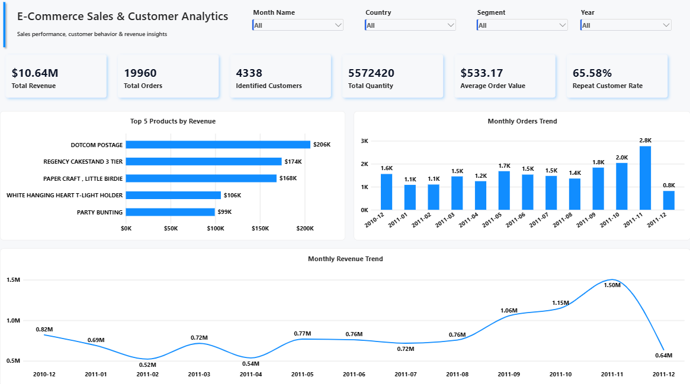
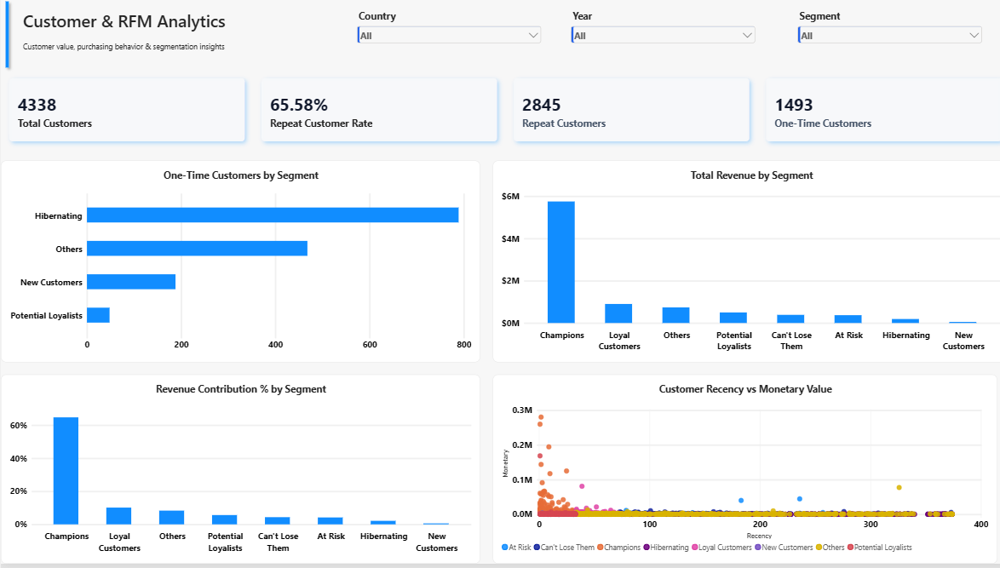
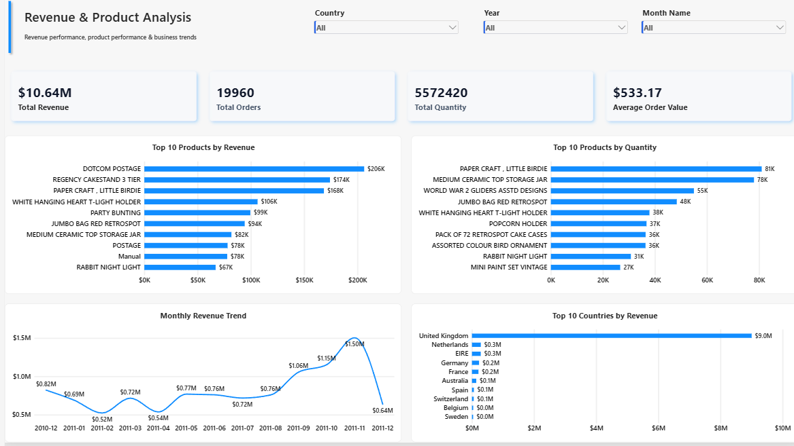

# 🛒 E-Commerce Sales & Customer Analytics

### End-to-End Data Analytics Project | Python | SQL | PostgreSQL | Power BI | RFM

An end-to-end **Data Analytics project** focused on understanding e-commerce sales performance, customer purchasing behavior, product performance, geographic performance, customer value, repeat purchasing, and revenue concentration.

The project transforms raw transactional retail data into structured business analysis using **Python, Pandas, NumPy, SQL, PostgreSQL, RFM Customer Segmentation, Power BI, DAX, and Power Query**.

---

## 📌 Table of Contents

- [Project Overview](#-project-overview)
- [Business Problem](#-business-problem)
- [Business Objectives](#-business-objectives)
- [Dataset](#-dataset)
- [Dataset Fields](#-dataset-fields)
- [Tools & Technologies](#-tools--technologies)
- [Project Workflow](#-project-workflow)
- [Data Validation](#-data-validation)
- [Data Cleaning](#-data-cleaning)
- [Cleaned Dataset](#-cleaned-dataset)
- [Feature Engineering](#-feature-engineering)
- [Key Performance Indicators](#-key-performance-indicators)
- [Exploratory Data Analysis](#-exploratory-data-analysis)
- [Sales Performance Analysis](#-sales-performance-analysis)
- [Product Analysis](#-product-analysis)
- [Geographic Analysis](#-geographic-analysis)
- [Customer Analysis](#-customer-analysis)
- [RFM Customer Segmentation](#-rfm-customer-segmentation)
- [RFM Scoring Method](#-rfm-scoring-method)
- [RFM Customer Segments](#-rfm-customer-segments)
- [RFM Segment Results](#-rfm-segment-results)
- [PostgreSQL & SQL Analysis](#-postgresql--sql-analysis)
- [Completed SQL Analysis](#-completed-sql-analysis)
- [SQL Business Findings](#-sql-business-findings)
- [Power BI Dashboard](#-power-bi-dashboard)
- [Page 1 — Executive Overview](#-page-1--executive-overview)
- [Page 2 — Customer & RFM Analytics](#-page-2--customer--rfm-analytics)
- [Page 3 — Revenue & Product Analysis](#-page-3--revenue--product-analysis)
- [Power BI Dashboard Design](#-power-bi-dashboard-design)
- [Dashboard Preview](#-dashboard-preview)
- [Dashboard Demo](#-dashboard-demo)
- [Business Insights](#-business-insights)
- [Business Recommendations](#-business-recommendations)
- [Repository Structure](#-repository-structure)
- [Project Status](#-project-status)
- [Skills Demonstrated](#-skills-demonstrated)
- [Analytical Concepts](#-analytical-concepts)
- [Data & Analytical Disclaimer](#-data--analytical-disclaimer)
- [Project Objective](#-project-objective)
- [Project Outcome](#-project-outcome)
- [Author](#-author)
- [Connect](#-connect)
- [Portfolio Project](#-portfolio-project)
- [Key Takeaway](#-key-takeaway)

---

## 📊 Project Overview

E-commerce businesses generate large volumes of transaction-level data containing information about products, orders, customers, prices, quantities, dates, and geographic markets.

This project analyzes transactional retail data to understand:

- Sales performance
- Revenue trends
- Order volume
- Average order value
- Product performance
- Geographic performance
- Customer purchasing behavior
- Customer value
- Purchase frequency
- Customer recency
- Repeat customer behavior
- RFM customer segments
- Revenue concentration

The project follows a complete **Data Analyst workflow**, starting from raw transactional data and ending with SQL analysis, customer segmentation, Power BI dashboards, and business recommendations.

---

## 🎯 Business Problem

Raw e-commerce transaction data contains valuable information, but transaction-level records alone do not provide a clear business view.

The objective is to convert raw transactions into structured analysis that can answer questions such as:

- How much revenue is generated?
- How many orders are placed?
- How many customers are identified?
- What is the average order value?
- Which products generate the most revenue?
- Which products have the highest sales quantity?
- Which countries generate the most revenue?
- How does revenue change over time?
- Which customers generate the highest monetary value?
- How many customers are repeat buyers?
- Which customers purchase frequently?
- Which customers have become inactive or appear at risk?
- Which RFM segments contribute the most revenue?
- How concentrated is revenue among high-value customers?

---

## 🎯 Business Objectives

The project aims to:

- Measure overall sales and revenue performance
- Analyze monthly revenue and order trends
- Measure order volume and average order value
- Identify high-performing products
- Compare product revenue and quantity performance
- Analyze geographic revenue performance
- Understand customer purchasing behavior
- Identify high-value customers
- Measure purchase frequency
- Measure customer recency
- Calculate repeat customer rate
- Perform RFM customer segmentation
- Measure revenue contribution by RFM segment
- Analyze revenue concentration among high-value customers
- Use PostgreSQL and SQL for business-focused analysis
- Build an interactive Power BI dashboard
- Translate analytical findings into business insights and recommendations

---

## 📂 Dataset

### UCI Online Retail Dataset

The project uses the **Online Retail Dataset** from the UCI Machine Learning Repository.

The dataset contains transactional records from a UK-based online retail business.

### Dataset Overview

| Attribute | Value |
|---|---:|
| Original Transactions | **541,909** |
| Original Columns | **8** |
| Time Period | **December 2010 – December 2011** |
| Data Type | Transactional Retail Data |

### Dataset Source

[UCI Machine Learning Repository](https://archive.ics.uci.edu/dataset/352/online%2Bretail)

### Dataset DOI

[https://doi.org/10.24432/C5BW33](https://doi.org/10.24432/C5BW33)

---

## 📋 Dataset Fields

| Column | Description |
|---|---|
| `InvoiceNo` | Invoice / transaction identifier |
| `StockCode` | Product or transaction code |
| `Description` | Product or transaction description |
| `Quantity` | Quantity purchased |
| `InvoiceDate` | Transaction date and time |
| `UnitPrice` | Price per unit |
| `CustomerID` | Customer identifier |
| `Country` | Customer country |

### Important Dataset Note

The dataset does **not** contain a `Category` field or a `Profit` field.

Therefore, this project focuses on:

- Revenue
- Orders
- Quantity
- Products / transaction codes
- Customers
- Countries
- Customer segmentation
- RFM analysis

> **Note:** Profitability and product-category analysis are not claimed in this project.

---

## 🛠️ Tools & Technologies

### Programming & Data Analysis

- Python
- Pandas
- NumPy

### Data Visualization

- Matplotlib
- Seaborn

### Database & SQL

- SQL
- PostgreSQL
- pgAdmin

### Business Intelligence

- Power BI
- DAX
- Power Query

### Development & Version Control

- Jupyter Notebook
- VS Code
- Git
- GitHub

---

## 🔄 Project Workflow

The project follows a structured Data Analytics workflow:

```text
Raw Transaction Data
        ↓
Data Inspection
        ↓
Data Validation
        ↓
Data Cleaning
        ↓
Feature Engineering
        ↓
KPI Development
        ↓
Exploratory Data Analysis
        ↓
Customer Analysis
        ↓
RFM Scoring
        ↓
Customer Segmentation
        ↓
PostgreSQL
        ↓
SQL Business Analysis
        ↓
Power BI Data Model
        ↓
Power BI Dashboard
        ↓
Business Insights
        ↓
Business Recommendations
```

---

## 🔍 Data Validation

The original dataset was inspected using **Python and Pandas** before cleaning.

### Data-Quality Checks

The following checks were performed:

- Missing values
- Duplicate records
- Negative quantities
- Non-positive unit prices
- Cancellation transactions
- Missing customer identifiers
- Missing product descriptions
- Date and data-type consistency

### Initial Data Quality Findings

| Data Quality Check | Result |
|---|---:|
| Original Records | **541,909** |
| Duplicate Records | **5,268** |
| Negative Quantity Records | **10,624** |
| Non-Positive Unit Price Records | **2,517** |
| Missing Description | **1,454** |
| Missing CustomerID | **135,080** |

### Cancellation Investigation

A total of **9,288 transaction rows** had invoice numbers beginning with `C`.

Among all negative-quantity transactions:

- **9,288** had invoice numbers beginning with `C`
- **1,336** negative-quantity rows did not begin with `C`

Further inspection showed that many of the non-cancelled negative-quantity rows were associated with zero prices, missing descriptions, and missing customer identifiers.

---

## 🧹 Data Cleaning

A separate analytical dataframe, `df_clean`, was created so that the raw dataset remained unchanged.

### Cleaning Rules

#### 1. Remove Exact Duplicate Records

```python
df_clean = df_clean.drop_duplicates()
```

#### 2. Keep Positive Quantities

For completed-sales analysis, transactions with non-positive quantities were excluded.

```python
df_clean = df_clean[df_clean["Quantity"] > 0]
```

This removes returns, cancellations, and other negative-quantity transaction records from the completed-sales dataset.

#### 3. Keep Positive Unit Prices

```python
df_clean = df_clean[df_clean["UnitPrice"] > 0]
```

Transactions with zero or negative prices were excluded from the normal sales/revenue dataset.

#### 4. Calculate Revenue

```text
Revenue = Quantity × UnitPrice
```

Python implementation:

```python
df_clean["Revenue"] = (
    df_clean["Quantity"] * df_clean["UnitPrice"]
)
```

#### 5. Reset the Index

```python
df_clean = df_clean.reset_index(drop=True)
```

---

## ✅ Cleaned Dataset

After applying the cleaning rules:

| Metric | Result |
|---|---:|
| Original Records | **541,909** |
| Cleaned Records | **524,878** |
| Net Rows Removed | **17,031** |
| Duplicate Rows Remaining | **0** |
| Invalid Quantity Rows Remaining | **0** |
| Invalid Price Rows Remaining | **0** |
| Missing CustomerID | **132,186** |
| Missing Description | **0** |

### Data Retention

Approximately **96.86%** of the original transaction records remain in the cleaned sales dataset.

### Generated Analytical Files

```text
dataset/
├── Online Retail.xlsx
├── online_retail_clean.csv
└── customer_rfm.csv
```

The raw dataset is preserved separately for reproducibility.

---

## ⚙️ Feature Engineering

Additional analytical fields were created from `InvoiceDate`.

### Date Features

- Year
- Month
- Month Name
- Day
- Day Name
- Hour
- Week
- Quarter
- Day of Week
- Year-Month

### Revenue Features

- Revenue
- Revenue Rounded

These engineered fields support time-based analysis, KPI calculations, SQL analysis, and Power BI reporting.

---

## 📈 Key Performance Indicators

The following KPIs are calculated from the cleaned sales dataset and reconciled across the project:

| KPI | Value |
|---|---:|
| Cleaned Sales Records | **524,878** |
| Total Revenue | **£10.64M** |
| Total Orders | **19,960** |
| Identified Customers | **4,338** |
| Total Quantity | **5,572,420** |
| Average Order Value | **£533.17** |
| Repeat Customers | **2,845** |
| One-Time Customers | **1,493** |
| Repeat Customer Rate | **65.58%** |

### KPI Definitions

#### Total Revenue

Sum of revenue across cleaned sales transactions.

#### Total Orders

Number of unique `InvoiceNo` values after cleaning and reconciliation.

#### Identified Customers

Number of unique customers with an available `CustomerID`.

#### Total Quantity

Total quantity of products sold in the cleaned sales dataset.

#### Average Order Value

```text
AOV = Total Revenue ÷ Unique Orders
```

#### Repeat Customer Rate

```text
Repeat Customer Rate =
(Repeat Customers ÷ Identified Customers) × 100
```

Current repeat customer rate:

**65.58%**

---

## 📊 Exploratory Data Analysis

Python was used to perform exploratory analysis across multiple business dimensions.

### Analysis Areas

- Monthly revenue
- Monthly order volume
- Revenue trends
- Order trends
- Product revenue
- Product quantity
- Country revenue
- Customer revenue
- Customer purchase frequency
- Customer recency
- Customer monetary value
- RFM segments

---

## 📅 Sales Performance Analysis

### Monthly Revenue

Monthly revenue was calculated using the engineered `Year_Month` field.

| Month | Revenue |
|---|---:|
| 2010-12 | £821,452.73 |
| 2011-01 | £689,811.61 |
| 2011-02 | £522,545.56 |
| 2011-03 | £716,215.26 |
| 2011-04 | £536,968.49 |
| 2011-05 | £769,296.61 |
| 2011-06 | £760,547.01 |
| 2011-07 | £718,076.12 |
| 2011-08 | £757,841.38 |
| 2011-09 | £1,056,435.19 |
| 2011-10 | £1,151,263.73 |
| 2011-11 | £1,503,866.78 |
| 2011-12 | £637,790.33 |

### Highest Observed Monthly Revenue

**November 2011 — £1,503,866.78**

November 2011 recorded the highest monthly revenue in the analyzed dataset.

---

## 📦 Product Analysis

Product-level analysis was performed using:

- `StockCode`
- `Description`
- `Quantity`
- `Revenue`

### Top 10 Products / Transaction Codes by Revenue

| Stock Code | Description | Revenue |
|---|---|---:|
| `DOT` | DOTCOM POSTAGE | £206,248.77 |
| `22423` | REGENCY CAKESTAND 3 TIER | £174,156.54 |
| `23843` | PAPER CRAFT, LITTLE BIRDIE | £168,469.60 |
| `85123A` | WHITE HANGING HEART T-LIGHT HOLDER | £104,284.24 |
| `47566` | PARTY BUNTING | £99,445.23 |
| `85099B` | JUMBO BAG RED RETROSPOT | £94,159.81 |
| `23166` | MEDIUM CERAMIC TOP STORAGE JAR | £81,700.92 |
| `POST` | POSTAGE | £78,101.88 |
| `M` | Manual | £77,750.27 |
| `23084` | RABBIT NIGHT LIGHT | £66,870.03 |

### Analytical Note

The revenue ranking contains both conventional merchandise and non-product/service transaction codes such as:

- `DOT` / DOTCOM POSTAGE
- `POST` / POSTAGE
- `M` / Manual

These transaction codes should be considered separately when interpreting product performance so that postage or manual transactions are not treated as conventional products.

### Top 10 Products / Transaction Codes by Quantity

| Stock Code | Description | Quantity |
|---|---|---:|
| `23843` | PAPER CRAFT, LITTLE BIRDIE | 80,995 |
| `23166` | MEDIUM CERAMIC TOP STORAGE JAR | 78,033 |
| `84077` | WORLD WAR 2 GLIDERS ASSTD DESIGNS | 54,951 |
| `85099B` | JUMBO BAG RED RETROSPOT | 48,371 |
| `85123A` | WHITE HANGING HEART T-LIGHT HOLDER | 37,580 |
| `22197` | POPCORN HOLDER | 36,749 |
| `22112` | PACK OF 72 RETROSPOT CAKE CASES | 36,396 |
| `84879` | ASSORTED COLOUR BIRD ORNAMENT | 36,362 |
| `23084` | RABBIT NIGHT LIGHT | 30,739 |
| `22492` | MINI PAINT SET VINTAGE | 26,633 |

### Revenue vs Quantity

Quantity and revenue measure different aspects of product performance.

A high-volume product is not necessarily the highest-revenue product.

Therefore, product performance is evaluated using both:

- **Quantity Sold**
- **Revenue Generated**

---

## 🌍 Geographic Analysis

Revenue was analyzed by country.

### Top 10 Countries by Revenue

| Country | Revenue |
|---|---:|
| United Kingdom | **£9,001,744.09** |
| Netherlands | £285,446.34 |
| EIRE | £283,140.52 |
| Germany | £228,678.40 |
| France | £209,625.37 |
| Australia | £138,453.81 |
| Spain | £61,558.56 |
| Switzerland | £57,067.60 |
| Belgium | £41,196.34 |
| Sweden | £38,367.83 |

### Geographic Insight

The United Kingdom represents the dominant revenue market in the current cleaned dataset.

Country-level analysis is used to understand:

- Revenue concentration
- Customer concentration
- Market performance
- Geographic opportunities requiring further investigation

---

## 👥 Customer Analysis

Customer-level analysis was performed using records with an available `CustomerID`.

The main cleaned sales dataset retains transactions without `CustomerID` because those transactions can still contribute to overall sales analysis.

A separate customer-level dataframe was created for customer analysis:

```python
df_customer = df_clean.dropna(
    subset=["CustomerID"]
).copy()
```

### Customer KPIs

| Metric | Value |
|---|---:|
| Identified Customers | **4,338** |
| Repeat Customers | **2,845** |
| One-Time Customers | **1,493** |
| Repeat Customer Rate | **65.58%** |

### Customer-Level Analysis Includes

- Total revenue
- Total orders
- Total quantity
- Average order value
- Purchase frequency
- Recency
- Monetary value

---

## 📌 RFM Customer Segmentation

RFM analysis was performed using customer-level transaction data.

RFM stands for:

- **R — Recency**
- **F — Frequency**
- **M — Monetary**

### Recency

Measures how recently a customer made a purchase.

**Lower Recency = More Recent Activity**

### Frequency

Measures how often a customer made purchases.

**Higher Frequency = More Frequent Purchases**

### Monetary

Measures how much revenue a customer generated.

**Higher Monetary Value = Higher Observed Customer Value**

RFM is used in this project as a **descriptive customer segmentation framework**.

---

## 📊 RFM Scoring Method

RFM metrics were converted into scores from **1 to 5**.

| Metric | Scoring Logic |
|---|---|
| Recency | Lower Recency → Higher Score |
| Frequency | Higher Frequency → Higher Score |
| Monetary | Higher Monetary Value → Higher Score |

Quintile-based scoring was used to create RFM scores.

### RFM Dataset Fields

```text
CustomerID
Recency
Frequency
Monetary
R_Score
F_Score
M_Score
RFM_Score
RFM_Code
Segment
```

The RFM dataset is stored in:

```text
dataset/customer_rfm.csv
```

---

## 🏷️ RFM Customer Segments

The current segmentation framework includes:

- Champions
- Loyal Customers
- Potential Loyalists
- New Customers
- At Risk
- Can't Lose Them
- Hibernating
- Others

Segments are assigned using combinations of RFM scores rather than a single monetary metric.

---

## 📊 RFM Segment Results

The current RFM analysis contains **4,338 identified customers**.

### Customer Distribution

| Segment | Customers | Share |
|---|---:|---:|
| Others | 1,035 | 23.86% |
| Champions | 948 | 21.85% |
| Hibernating | 824 | 18.99% |
| Loyal Customers | 456 | 10.51% |
| Potential Loyalists | 425 | 9.80% |
| At Risk | 287 | 6.62% |
| New Customers | 190 | 4.38% |
| Can't Lose Them | 173 | 3.99% |

### RFM Segment Performance

| Segment | Customers | Avg Recency | Avg Frequency | Avg Monetary | Total Revenue | Revenue Contribution |
|---|---:|---:|---:|---:|---:|---:|
| Champions | 948 | 13.13 | 11.17 | £6,068.16 | £5,752,618.52 | 64.73% |
| Loyal Customers | 456 | 39.17 | 5.28 | £1,976.16 | £901,128.00 | 10.14% |
| Others | 1,035 | 105.94 | 1.72 | £713.26 | £738,228.10 | 8.31% |
| Potential Loyalists | 425 | 17.31 | 2.23 | £1,174.93 | £499,343.64 | 5.62% |
| Can't Lose Them | 173 | 124.54 | 5.50 | £2,229.60 | £385,720.16 | 4.34% |
| At Risk | 287 | 151.03 | 2.79 | £1,290.53 | £370,381.77 | 4.17% |
| Hibernating | 824 | 228.09 | 1.04 | £228.66 | £188,415.28 | 2.12% |
| New Customers | 190 | 18.69 | 1.01 | £270.39 | £51,373.42 | 0.58% |

### Analytical Note

The RFM revenue contribution percentages are calculated from the **4,338 identified customers included in the RFM dataset**, not from all 524,878 cleaned transaction records.

The Champions segment contributes the largest share of observed RFM monetary value.

---

## 🐘 PostgreSQL & SQL Analysis

The cleaned sales data and customer RFM data were loaded into PostgreSQL for business-focused SQL analysis.

### PostgreSQL Database

```text
ecommerce_analytics_db
```

### Main Tables

#### `ecommerce_sales`

Transaction-level cleaned sales data containing:

- Invoice information
- Product information
- Quantity
- Invoice date
- Unit price
- Customer ID
- Country
- Revenue
- Date features

#### `customer_rfm`

Customer-level RFM data containing:

- Customer ID
- Recency
- Frequency
- Monetary
- RFM scores
- RFM code
- Customer segment

---

## 🧮 Completed SQL Analysis

The PostgreSQL and SQL layer covers:

- Overall business KPIs
- Monthly revenue analysis
- Product / transaction-code analysis
- Country revenue analysis
- Customer revenue analysis
- Customer order frequency
- Repeat customer analysis
- RFM segment analysis
- RFM revenue contribution
- At-Risk customer analysis
- Can't-Lose-Them analysis
- Champions analysis
- Customer revenue concentration
- Python / PostgreSQL KPI reconciliation

### SQL Techniques Applied

- `SELECT`
- `WHERE`
- `GROUP BY`
- `ORDER BY`
- Aggregate functions
- `COUNT`
- `COUNT DISTINCT`
- `SUM`
- `AVG`
- Common Table Expressions
- Window Functions
- Business KPI calculations

---

## 🔎 SQL Business Findings

### 1. Repeat Customer Analysis

Among the 4,338 identified customers:

| Metric | Value |
|---|---:|
| Repeat Customers | **2,845** |
| One-Time Customers | **1,493** |
| Repeat Customer Rate | **65.58%** |

### 2. Identified-Customer Revenue

Identified customers generated approximately:

**£8,887,208.89**

This represents revenue associated with transactions where `CustomerID` was available.

It is lower than total transaction revenue because transactions without `CustomerID` are excluded from customer-level analysis.

### 3. Revenue Concentration

The top 10% of identified customers consist of:

**434 customers**

These customers generated:

**£5,461,374.89**

representing:

**61.45%**

of identified-customer revenue.

### 4. Champions Revenue Contribution

The Champions segment generated:

**£5,752,618.52**

and contributed:

**64.73%**

of identified-customer RFM revenue.

### 5. At-Risk Customers

The At Risk segment contains:

**287 customers**

with:

**£370,381.77**

in observed monetary value.

Average recency:

**151.03 days**

### 6. Can't Lose Them

The Can't Lose Them segment contains:

**173 customers**

with:

**£385,720.16**

in observed monetary value.

Average frequency:

**5.50 orders**

Average recency:

**124.54 days**

### 7. Python / PostgreSQL KPI Reconciliation

The project reconciled the unique order count between Python and PostgreSQL.

Final project-wide order KPI:

**19,960 unique orders**

This reconciliation helps maintain consistency between the Python analytical layer, PostgreSQL analysis, and Power BI reporting layer.

---

## 📊 Power BI Dashboard

Power BI is the final business intelligence layer of the project.

The completed dashboard contains **3 pages**, covering:

1. Executive performance
2. Customer and RFM analytics
3. Revenue and product analysis

---

## 📄 Page 1 — Executive Overview

### Purpose

Provide a high-level view of overall e-commerce sales and customer performance.

### Page Title

**E-Commerce Sales & Customer Analytics**

### Subtitle

**Sales performance, customer behavior & revenue insights**

### Slicers

- Month Name
- Country
- Segment
- Year

### KPI Cards

| KPI | Value |
|---|---:|
| Total Revenue | **£10.64M** |
| Total Orders | **19,960** |
| Identified Customers | **4,338** |
| Total Quantity | **5,572,420** |
| Average Order Value | **£533.17** |
| Repeat Customer Rate | **65.58%** |

### Visuals

1. **Top 5 Products by Revenue**
2. **Monthly Orders Trend**
3. **Monthly Revenue Trend**

### Page Objective

This page provides an executive-level summary of:

- Revenue performance
- Order volume
- Customer base
- Product performance
- Monthly trends
- Repeat purchasing

---

## 📄 Page 2 — Customer & RFM Analytics

### Purpose

Understand customer value, purchasing behavior, and RFM segmentation.

### Page Title

**Customer & RFM Analytics**

### Subtitle

**Customer value, purchasing behavior & segmentation insights**

### Slicers

- Country
- Year
- Segment

### KPI Cards

| KPI | Value |
|---|---:|
| Total Customers | **4,338** |
| Repeat Customer Rate | **65.58%** |
| Repeat Customers | **2,845** |
| One-Time Customers | **1,493** |

### Visuals

1. **One-Time Customers by Segment**
2. **Total Revenue by Segment**
3. **Revenue Contribution by Segment**
4. **Customer Recency vs Monetary Value**

### Scatter Plot Configuration

| Property | Configuration |
|---|---|
| X Axis | Recency |
| Y Axis | Monetary |
| Legend | Segment |

The scatter plot is used to visually compare customer recency and monetary value across RFM segments.

### Revenue Contribution Measure

```DAX
Revenue Contribution % =
DIVIDE(
    SUM('Customer_RFM'[Monetary]),
    CALCULATE(
        SUM('Customer_RFM'[Monetary]),
        ALL('Customer_RFM'[Segment])
    ),
    0
)
```

The measure is formatted as a percentage.

### One-Time Customers Measure

```DAX
One-Time Customers =
CALCULATE(
    DISTINCTCOUNT('customer_rfm'[CustomerID]),
    'customer_rfm'[Frequency] = 1
)
```

> **Note:** Table and column names should match the actual Power BI model.

### Page Objective

This page helps analyze:

- Customer retention
- Repeat purchasing
- One-time customers
- Customer monetary value
- RFM segment performance
- Revenue contribution
- At-risk customer groups

---

## 📄 Page 3 — Revenue & Product Analysis

### Purpose

Analyze revenue performance, product performance, and geographic trends.

### Page Title

**Revenue & Product Analysis**

### Subtitle

**Revenue performance, product performance & business trends**

### Slicers

- Country
- Year

### KPI Cards

- Total Revenue
- Total Orders
- Total Quantity
- Average Order Value

### Visuals

1. **Top 10 Products by Revenue**
2. **Top 10 Products by Quantity**
3. **Monthly Revenue Trend**
4. **Revenue by Country**

### Top 10 Products by Revenue Configuration

| Property | Configuration |
|---|---|
| Visual Type | Clustered Bar Chart |
| Y Axis | Description |
| X Axis | Total Revenue |
| Filter | Top 10 by Total Revenue |
| Sort | Total Revenue Descending |

Data labels are enabled for readability.

### Page Objective

This page focuses on:

- Revenue performance
- Product revenue
- Product volume
- Monthly revenue trends
- Geographic revenue distribution

---

## 🎨 Power BI Dashboard Design

The dashboard follows a consistent professional visual style.

### Color Palette

| Element | Color |
|---|---|
| Header | `#111827` |
| Primary Accent | `#2563EB` |
| Positive / Retained | `#16A34A` |
| Risk / Negative | `#DC2626` |
| Page Background | `#F7F8FA` |
| Card Background | `#FFFFFF` |
| Border | `#E2E8F0` |
| Secondary Text | `#CBD5E1` |

### Design Principles

- Consistent page titles
- Clear KPI cards
- Limited visual clutter
- Business-focused charts
- Consistent slicer placement
- Clear visual hierarchy
- Consistent formatting across all pages

---

## 🖼️ Dashboard Preview

The final Power BI dashboard contains three analytical pages designed to present sales performance, customer behavior, RFM segmentation, and revenue insights in a clear business-focused format.

### Page 1 — Executive Overview



---

### Page 2 — Customer & RFM Analytics



---

### Page 3 — Revenue & Product Analysis



---

## 🎥 Dashboard Demo

A walkthrough recording of the completed Power BI dashboard is included in the repository.

[▶️ Watch Dashboard Demo](visuals/E-Commerce_Sales_Video.mp4)

The recording demonstrates the three completed Power BI dashboard pages and their interactive analytical views.

---

## 💡 Business Insights

The completed analysis identified several important patterns.

### 1. Revenue is Highly Concentrated in the United Kingdom

The United Kingdom generated approximately:

**£9,001,744.09**

in the cleaned sales dataset.

This is substantially higher than the revenue generated by any other individual country in the dataset.

### 2. November 2011 Recorded the Highest Monthly Revenue

**November 2011 — £1,503,866.78**

was the highest observed monthly revenue.

### 3. Repeat Purchasing Represents a Major Portion of Identified Customers

Among identified customers:

- **4,338 identified customers**
- **2,845 repeat customers**
- **65.58% repeat customer rate**

This shows that a substantial share of identified customers placed more than one order during the analyzed period.

### 4. Revenue is Concentrated Among High-Value Customers

The top 10% of identified customers consist of:

**434 customers**

and generated:

**£5.46M**

or:

**61.45%**

of identified-customer revenue.

### 5. Champions Contribute the Largest Share of RFM Revenue

The Champions segment contains:

**948 customers**

and contributes:

**64.73%**

of identified-customer RFM revenue.

### 6. Hibernating Customers Show Low Recent Activity

The Hibernating segment contains:

- **824 customers**
- **Average Recency ≈ 228 days**
- **Average Frequency ≈ 1.04 orders**
- **Average Monetary ≈ £228.66**

This segment shows comparatively low purchase frequency and long recency.

### 7. At-Risk and Can't-Lose-Them Customers Need Retention Analysis

The RFM framework identifies customer groups with longer recency values while still showing meaningful historical purchasing activity or monetary value.

These groups provide useful targets for retention and re-engagement analysis.

### 8. Quantity and Revenue Provide Different Views of Product Performance

The products or transaction codes with the highest quantities are not necessarily the same as those generating the highest revenue.

Therefore, product performance should be evaluated using both:

- **Quantity Sold**
- **Revenue Generated**

---

## 🎯 Business Recommendations

The recommendations below are derived from the observed analytical patterns and should be validated with additional business context before implementation.

### 1. Customer Retention

Develop targeted retention and re-engagement strategies for:

- At Risk customers
- Can't Lose Them customers
- Hibernating customers

Potential analytical actions include:

- Prioritizing customers by recency
- Combining recency with historical monetary value
- Testing targeted re-engagement campaigns
- Monitoring repeat-purchase behavior

### 2. High-Value Customer Management

Analyze Champions and Loyal Customers for:

- Personalized offers
- Loyalty initiatives
- Repeat-purchase campaigns
- Cross-selling opportunities
- Customer-value monitoring

### 3. Customer Reactivation

Use RFM information to identify inactive customers based on:

- Recency
- Frequency
- Monetary value

Potential reactivation strategies can then be evaluated based on customer value and previous purchasing behavior.

### 4. Product Strategy

Separate conventional merchandise from non-product transaction codes such as:

- Postage
- DOTCOM POSTAGE
- Manual transactions

Then evaluate:

- High-revenue products
- High-volume products
- Products with different revenue/quantity patterns
- Service and manual transaction activity separately

### 5. Geographic Analysis

Use country-level:

- Revenue
- Customer count
- Order count

to understand:

- Strong markets
- Revenue concentration
- Customer concentration
- Markets requiring further investigation

---

## 📁 Repository Structure

```text
ecommerce-sales-customer-analytics/
│
├── dataset/
│   ├── Online Retail.xlsx
│   ├── online_retail_clean.csv
│   └── customer_rfm.csv
│
├── notebooks/
│   └── ecommerce_sales_customer_analysis.ipynb
│
├── sql/
│   └── ecommerce_sales_analysis.sql
│
├── powerbi/
│   └── ecommerce_sales_customer_analytics.pbix
│
├── visuals/
│   ├── Page_1.png
│   ├── Page_2.png
│   ├── Page_3.png
│   └── E-Commerce_Sales_Video.mp4
│
├── .gitignore
└── README.md
```

---

## 📌 Project Status

| Component | Status |
|---|:---:|
| Repository Setup | ✅ Completed |
| GitHub Repository | ✅ Completed |
| README Documentation | ✅ Completed |
| Dataset Added | ✅ Completed |
| Python Notebook | ✅ Completed |
| Initial Data Inspection | ✅ Completed |
| Data Validation | ✅ Completed |
| Data Cleaning | ✅ Completed |
| Revenue Calculation | ✅ Completed |
| Feature Engineering | ✅ Completed |
| KPI Analysis | ✅ Completed |
| Sales EDA | ✅ Completed |
| Country Analysis | ✅ Completed |
| Product / Transaction Analysis | ✅ Completed |
| Customer Analysis | ✅ Completed |
| RFM Dataset Creation | ✅ Completed |
| RFM Scoring | ✅ Completed |
| RFM Customer Segmentation | ✅ Completed |
| RFM Segment Analysis | ✅ Completed |
| PostgreSQL Database Setup | ✅ Completed |
| PostgreSQL Data Import | ✅ Completed |
| SQL KPI Analysis | ✅ Completed |
| SQL Monthly Revenue Analysis | ✅ Completed |
| SQL Product Analysis | ✅ Completed |
| SQL Country Analysis | ✅ Completed |
| SQL Customer Analysis | ✅ Completed |
| SQL Repeat Customer Analysis | ✅ Completed |
| SQL RFM Analysis | ✅ Completed |
| SQL Revenue Contribution Analysis | ✅ Completed |
| SQL Revenue Concentration Analysis | ✅ Completed |
| Python / PostgreSQL KPI Reconciliation | ✅ Completed |
| Power BI Data Model | ✅ Completed |
| Power BI Page 1 | ✅ Completed |
| Power BI Page 2 | ✅ Completed |
| Power BI Page 3 | ✅ Completed |
| Power BI Dashboard | ✅ Completed |
| Dashboard Screenshots | ✅ Completed |
| Dashboard Demo Video | ✅ Completed |
| Business Insights | ✅ Completed |
| Business Recommendations | ✅ Completed |
| Final Documentation | ✅ Completed |

### Overall Status

> **✅ Project Completed**

The project now contains the complete **Python, SQL/PostgreSQL, RFM, and Power BI analytical workflow**.

---

## 🧠 Skills Demonstrated

### Python

- Python
- Pandas
- NumPy
- DataFrame manipulation
- GroupBy analysis
- Data cleaning
- Data validation
- Feature engineering
- KPI calculation
- Exploratory Data Analysis

### Data Visualization

- Matplotlib
- Seaborn
- Time-series visualization
- Revenue visualization
- Customer segmentation visualization
- Business-oriented charts

### SQL & PostgreSQL

- SQL
- PostgreSQL
- pgAdmin
- Aggregation
- `GROUP BY`
- `ORDER BY`
- `COUNT`
- `COUNT DISTINCT`
- `SUM`
- `AVG`
- Common Table Expressions
- Window Functions
- Business KPI queries
- Monthly analysis
- Product analysis
- Geographic analysis
- Customer analysis
- RFM analysis

### Customer Analytics

- Customer revenue analysis
- Purchase frequency
- Repeat customer analysis
- Recency analysis
- Monetary analysis
- RFM scoring
- RFM segmentation
- Customer revenue concentration

### Power BI

- Power BI
- Power Query
- DAX
- Data modeling
- KPI cards
- Slicers
- Bar charts
- Line charts
- Scatter plots
- Dashboard development
- Business reporting
- Data storytelling

### Development & Version Control

- Jupyter Notebook
- VS Code
- Git
- GitHub
- Repository organization
- Project documentation

---

## 📚 Analytical Concepts

This project applies:

- Descriptive Analytics
- Exploratory Data Analysis
- Data Cleaning
- Data Validation
- Feature Engineering
- KPI Analysis
- Sales Trend Analysis
- Revenue Analysis
- Customer Analytics
- Product Performance Analysis
- Geographic Analysis
- Repeat Customer Analysis
- Revenue Concentration Analysis
- RFM Analysis
- Customer Segmentation
- Business Intelligence
- Data Storytelling
- Data-Driven Decision Making

---

## ⚠️ Data & Analytical Disclaimer

The raw dataset is preserved separately from the cleaned analytical dataset to maintain reproducibility.

The cleaned sales dataset excludes:

- Exact duplicate transaction rows
- Non-positive quantity records
- Non-positive unit-price records

Transactions without `CustomerID` are retained in the main sales-analysis dataset because they can still contribute to overall sales analysis.

Customer-level and RFM analysis use transactions with available customer identifiers.

RFM is a **descriptive customer segmentation framework**, not a predictive machine-learning model.

Revenue contribution figures for RFM segments are calculated from the **4,338 identified customers included in the RFM dataset**, rather than from all transaction records.

The identified-customer revenue figure differs from total transaction revenue because transactions without `CustomerID` are excluded from customer-level analysis.

The dataset does not contain Profit or Category fields, so this project does not claim profitability or category-level analysis.

Observed patterns describe relationships within the analyzed dataset and should not automatically be interpreted as causal relationships.

Business recommendations should be validated using additional business context, experimentation, and operational considerations before implementation.

---

## 🎯 Project Objective

The objective of this project is to demonstrate a complete practical **Data Analyst workflow** using real-world transactional e-commerce data.

```text
Raw Data
   ↓
Data Validation
   ↓
Data Cleaning
   ↓
Feature Engineering
   ↓
Python EDA
   ↓
KPI Analysis
   ↓
Customer Analysis
   ↓
RFM Segmentation
   ↓
PostgreSQL
   ↓
SQL Business Analysis
   ↓
Power BI
   ↓
Business Insights
   ↓
Business Recommendations
```

The project demonstrates the ability to transform raw transaction data into structured business analysis and decision-support outputs.

---

## 🏆 Project Outcome

This project demonstrates the ability to work through a complete Data Analytics lifecycle:

- Understand a business problem
- Inspect transactional data
- Identify data-quality issues
- Clean and prepare analytical data
- Engineer useful analytical features
- Calculate business KPIs
- Perform exploratory data analysis
- Analyze products and geographic markets
- Analyze customer purchasing behavior
- Perform RFM customer segmentation
- Conduct PostgreSQL and SQL business analysis
- Reconcile analytical results across tools
- Build interactive Power BI dashboards
- Communicate findings through visualizations
- Translate analysis into business recommendations

The project combines technical analysis with business-oriented interpretation and demonstrates practical skills relevant to **Data Analyst, Junior Data Analyst, and BI Analyst** roles.

---

## 👤 Author

### Uveshkhan Lohani

**B.E. Information Technology Graduate | Aspiring Data Analyst**

Focused on building practical expertise in:

- Data Analytics
- Python
- SQL
- PostgreSQL
- Power BI
- Microsoft Excel
- Business Intelligence
- Data Visualization

---

## 🔗 Connect

### GitHub

[Uveshkhan2005](https://github.com/Uveshkhan2005)

### LinkedIn

[Uveshkhan Lohani](https://www.linkedin.com/in/uveshkhan-lohani-615793273/)

### Email

`uveshkhanlohani65@gmail.com`

---

## 📌 Portfolio Project

This project is part of my **Data Analytics portfolio** and demonstrates practical experience in transforming transactional retail data into business-oriented analytical outputs.

The project demonstrates the complete journey:

```text
Data
 ↓
Cleaning
 ↓
Analysis
 ↓
Customer Understanding
 ↓
SQL / Database Analysis
 ↓
RFM Segmentation
 ↓
Business Intelligence
 ↓
Decision Support
```

---

## 🚀 Key Takeaway

> **E-Commerce Sales & Customer Analytics demonstrates how transactional retail data can be transformed into meaningful business intelligence using Python, SQL, PostgreSQL, RFM customer segmentation, and Power BI.**
